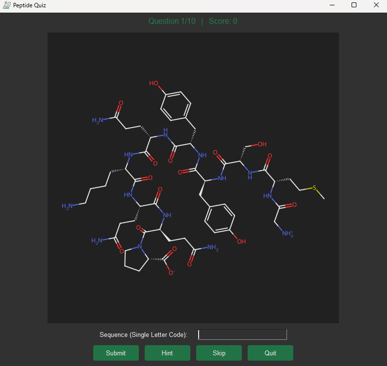
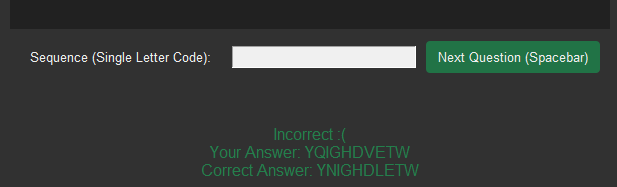
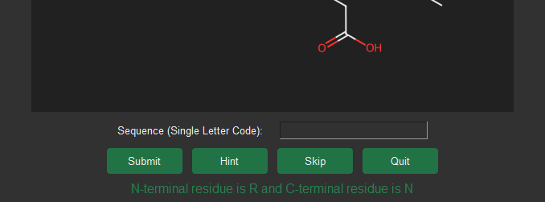
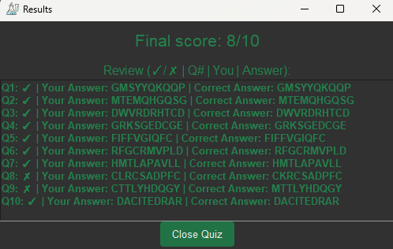
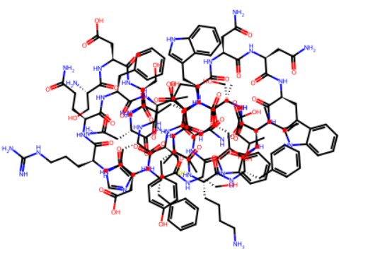

# Peptide Generator and Quiz

## Description:

### A: Overview
This project is an interactive peptide / Amino Acid (AA) structure quiz. When run, the user has a choice of difficulty, from single Amino Acid structures all the way to 10-mer peptides (10 AAs long).

 They are presented with 10 questions (sequentially) which display a randomly generated molecule, and are prompted to type its sequence in Single-Letter Amino Acid code. If the answer is incorrect, users can review feedback for as long as they like before moving to the next question. Scores and answers are all recorded and presented at the end.

#### **Who is it for?** 
This project is mainly aimed towards undergraduate students in pre-medicine and the general field of biochemistry, where a strong understanding of amino acid / peptide structure is crucial for success.

#### **What motivated me to make this?**
As a third year Biochemistry/Genetics undergraduate who is particularly interested in peptide chemistry, I recall my own journey in learning Amino Acid structures where I struggled to find any reputable resources outside of my own memory and poorly structured websites (if any). Most quizzes test single Amino Acids and are essentially testing how well you can remember where each label goes over each iteration of the quiz, rather than developing a true understanding. My quiz constructs larger complex biomolecules from the basic AA building blocks with a partially folded conformation in a way that is completely new (random) for each molecule. Another advantage of my quiz (over the current quizzes) is the cleaner 2D structure that conforms to the modern design of organic molecules on paper. Furthermore, online quizzes that present peptides (many AAs together) are either extremely hard to find or do not exist from my anecdotal experience. <br>
The quiz and molecule-builder itself is fast enough to provide a polypeptide instantly per question, however it may not be optimised in terms of speed or memory since I am in Biochemistry and not Computer Science. Scientists do have a reputation for not being the most efficient programmers - but it does get the job done.

--------------

#### **Prerequisites to run the quiz**

You will need to install both rdkit and pillow libraries. The rest are included with Python.
Run:

```pip install pillow```

```pip install rdkit```

Ensure all required files are included. You will need the **```images```** folder for the icon, **```forest-dark.tcl```** and **```forest-dark```** folder (both) in order to run the Forest Dark theme without errors.. <br><br>
I am working on either building this into an executable app or website where everything can be included at once. For now, it is merely a proof-of-concept where I have shown that it is possible by me, and I may expand on its implementation later on when I have time outside of studies.

#### Key Features
- Random peptide generation (1–10 residues)
- Two molecular representations (Folded vs Linear)
- Collision detection to avoid overlapping structures
- Interactive GUI quiz with scoring and feedback


----------------
### B: User Interaction
#### **Mode Selection**
The user is presented with a GUI window that prompts them to pick a difficulty and molecular representation:


Single Amino Acid mode will present 10 individual AAs in random order.

Easy mode will give the user peptides that are 3AAs in length.

Medium mode will give the user peptides that are 5AAs in length.

Hard mode will give the user peptides that are 10AAs in length. Below is an image of what Hard mode looks like with Folded View:




#### **User input / answer**
The user will type their answer in the \<Sequence: > textbox and either click submit or press enter.

If correct, they will proceed into the next question. If the user answers incorrectly, they will be presented with feedback like this:




where they can press Next Question, or \<spacebar> to continue to the next question.

#### **Hint Button**
If the user is struggling with a particular question, they can click \<Hint> for some help. It will provide them with the N and C terminus of the peptide (essentially the first and last residues).




 This hint doesn't reveal too much since a stronger student can easily identify both termini by looking for the ionised atoms (protonated amine and deprotonated carboxyl) towards the end of peptide linkage chains.


#### **Final Results / Feedback**
Upon completion, either by completing all 10 questions or exiting early via the \<quit> button, they will be presented with a feedback window which provides a final score out of 10 as well as their feedback per question like this:

 

--------------

### C: How it works internally
I am very new to the rdkit module used to work with molecules and chemistry in general, so this will show how my interpretation of its functionality was used to build molecules.

#### **Small Chemistry lesson**
<details>
  <summary>Click to expand/collapse - A crash course in the bare fundamentals of peptide chemistry (useful but not entirely necessary to understand this project as a reader)</summary>

Amino Acids are small molecules with a common 'backbone' that consists of a Amine (NH2), Carboxyl group (COOH) - both bound to a central carbon called Carbon Alpha. Carbon Alpha has one hydrogen bound to it with space for one more bond. This bond is typically denoted as the 'R' group since it can technically contain anything - It is the variable region of all amino acids. That is - All Amino Acids share the common backbone, and only differ in R groups.


Those R groups of the 20 common 'proteogenic' Amino Acids are highlighted here. These are the building blocks of peptides, which are folded and processed into Proteins intracellularly by organisms - They are also commonly referred to as the "end-point of DNA" wherein the unique information our DNA encodes for is the main driver of which Amino Acids are joined together during protein formation. 

Amino Acids join together via 'peptide bonds' where an OH from the hydroxyl of one AA combine with the NH<sub>2</sub> of another AA. 


H<sub>2</sub>O (water) is released as a byproduct and NH remains. This reaction can occur any number of times to create polypeptides of any length. The largest protein in the human body (Titin) can have up to >38,000 AAs!!! But average protein length in humans is somewhere between 300-400AAs long. Small peptides (2-40AAs) are still used as pharmaceutical compounds and lab reagents in both medicine and biochemistry so they're still important.

Students who take this quiz should well-versed in the theory of Biochemistry and peptide structure.
</details>


#### **Formation of Amino Acid Dictionaries and how they were used to create peptides**


<details>
  <summary>Click to expand/collapse - Overview of the 5 large Dict objects used to store Amino Acid information</summary>  

```
AA_dict = {
    1: "N[C@@H](C)C(=O)O",
    2: "N[C@@H](CCCNC(=N)N)C(=O)O",
    3: "N[C@@H](CC(=O)N)C(=O)O",
    4: "N[C@@H](CC(=O)O)C(=O)O",
    5: "N[C@@H](CS)C(=O)O",
    6: "N[C@@H](CCC(=O)O)C(=O)O",
    7: "N[C@@H](CCC(=O)N)C(=O)O",
    8: "NCC(=O)O",
    9: "N[C@@H](CC1=CN=CN1)C(=O)O",
    10: "N[C@@H](C(C)CC)C(=O)O",
    11: "N[C@@H](CC(C)C)C(=O)O",
    12: "N[C@@H](CCCCN)C(=O)O",
    13: "N[C@@H](CCSC)C(=O)O",
    14: "N[C@@H](Cc1ccccc1)C(=O)O",
    15: "N1[C@@H](CCC1)C(=O)O",
    16: "N[C@@H](CO)C(=O)O",
    17: "N[C@@H](C(O)C)C(=O)O",
    18: "N[C@@H](Cc1c[nH]c2ccccc12)C(=O)O",
    19: "N[C@@H](Cc1ccc(O)cc1)C(=O)O",
    20: "N[C@@H](C(C)C)C(=O)O",
}
#Dict of all regular AAs for constructing the middle residues of peptides

AA_dict_Nterm_Protonated = {
    1: "[NH3+][C@@H](C)C(=O)O",
    2: "[NH3+][C@@H](CCCNC(=N)N)C(=O)O",
    3: "[NH3+][C@@H](CC(=O)N)C(=O)O",
    4: "[NH3+][C@@H](CC(=O)O)C(=O)O",
    5: "[NH3+][C@@H](CS)C(=O)O",
    6: "[NH3+][C@@H](CCC(=O)O)C(=O)O",
    7: "[NH3+][C@@H](CCC(=O)N)C(=O)O",
    8: "[NH3+]CC(=O)O",
    9: "[NH3+][C@@H](CC1=CN=CN1)C(=O)O",
    10: "[NH3+][C@@H](C(C)CC)C(=O)O",
    11: "[NH3+][C@@H](CC(C)C)C(=O)O",
    12: "[NH3+][C@@H](CCCCN)C(=O)O",
    13: "[NH3+][C@@H](CCSC)C(=O)O",
    14: "[NH3+][C@@H](Cc1ccccc1)C(=O)O",
    15: "[NH2+]1[C@@H](CCC1)C(=O)O",
    16: "[NH3+][C@@H](CO)C(=O)O",
    17: "[NH3+][C@@H](C(O)C)C(=O)O",
    18: "[NH3+][C@@H](Cc1c[nH]c2ccccc12)C(=O)O",
    19: "[NH3+][C@@H](Cc1ccc(O)cc1)C(=O)O",
    20: "[NH3+][C@@H](C(C)C)C(=O)O",
}
#Dict of AAs with a protonated N-term for constructing the first residue of a peptide

AA_dict_Cterm_Deprotonated = {
    1: "N[C@@H](C)C(=O)[O-]",
    2: "N[C@@H](CCCNC(=N)N)C(=O)[O-]",
    3: "N[C@@H](CC(=O)N)C(=O)[O-]",
    4: "N[C@@H](CC(=O)O)C(=O)[O-]",
    5: "N[C@@H](CS)C(=O)[O-]",
    6: "N[C@@H](CCC(=O)O)C(=O)[O-]",
    7: "N[C@@H](CCC(=O)N)C(=O)[O-]",
    8: "NCC(=O)[O-]",
    9: "N[C@@H](CC1=CN=CN1)C(=O)[O-]",
    10: "N[C@@H](C(C)CC)C(=O)[O-]",
    11: "N[C@@H](CC(C)C)C(=O)[O-]",
    12: "N[C@@H](CCCCN)C(=O)[O-]",
    13: "N[C@@H](CCSC)C(=O)[O-]",
    14: "N[C@@H](Cc1ccccc1)C(=O)[O-]",
    15: "N1[C@@H](CCC1)C(=O)[O-]",
    16: "N[C@@H](CO)C(=O)[O-]",
    17: "N[C@@H](C(O)C)C(=O)[O-]",
    18: "N[C@@H](Cc1c[nH]c2ccccc12)C(=O)[O-]",
    19: "N[C@@H](Cc1ccc(O)cc1)C(=O)[O-]",
    20: "N[C@@H](C(C)C)C(=O)[O-]",
}
#Dict of AAs with a deprotonated C-term for constructing the last residue of a peptide

AA_dict_CandN_term_ionised = {
    1: "[NH3+][C@@H](C)C(=O)[O-]",
    2: "[NH3+][C@@H](CCCNC(=N)N)C(=O)[O-]",
    3: "[NH3+][C@@H](CC(=O)N)C(=O)[O-]",
    4: "[NH3+][C@@H](CC(=O)O)C(=O)[O-]",
    5: "[NH3+][C@@H](CS)C(=O)[O-]",
    6: "[NH3+][C@@H](CCC(=O)O)C(=O)[O-]",
    7: "[NH3+][C@@H](CCC(=O)N)C(=O)[O-]",
    8: "[NH3+]CC(=O)[O-]",
    9: "[NH3+][C@@H](CC1=CN=CN1)C(=O)[O-]",
    10: "[NH3+][C@@H](C(C)CC)C(=O)[O-]",
    11: "[NH3+][C@@H](CC(C)C)C(=O)[O-]",
    12: "[NH3+][C@@H](CCCCN)C(=O)[O-]",
    13: "[NH3+][C@@H](CCSC)C(=O)[O-]",
    14: "[NH3+][C@@H](Cc1ccccc1)C(=O)[O-]",
    15: "[NH2+]1[C@@H](CCC1)C(=O)[O-]",
    16: "[NH3+][C@@H](CO)C(=O)[O-]",
    17: "[NH3+][C@@H](C(O)C)C(=O)[O-]",
    18: "[NH3+][C@@H](Cc1c[nH]c2ccccc12)C(=O)[O-]",
    19: "[NH3+][C@@H](Cc1ccc(O)cc1)C(=O)[O-]",
    20: "[NH3+][C@@H](C(C)C)C(=O)[O-]",
}
#Dict of AAs with both C and N term ionised for outputting single AAs in their zwitterionic form

AA_names_dict = {
    1: "A", 2: "R", 3: "N", 4: "D",
    5: "C", 6: "E", 7: "Q", 8: "G",
    9: "H", 10: "I", 11: "L", 12: "K",
    13: "M", 14: "F", 15: "P", 16: "S",
    17: "T", 18: "W", 19: "Y", 20: "V",
}
#Dict relating each AA to a number from 1-20 for random generation
```
</details>  

####
A dictionary was created for all forms of Amino Acids that may occur. One where the N-terminus (Amino group) is ionised and one where the C-terminus (Carboxy group) is ionised. This is because the N-term (first) and C-term (last) Amino Acids in a peptide are typically ionised (charged) at physiological pH (7.35-7.45). One dict contains Amino Acids where both termini are charged for the Single AA Quiz mode.

These Amino Acids were stored in a SMILES format (Simplified Molecular Input Line Entry System ) - A text-based notation for representing chemical structures as short strings, very commonly used in Cheminformatics. The RDkit.Chem library is built to work with these objects.

The Random module was used to pick Amino Acids at random from those Dicts and use them for peptide formation.
Chemicals in SMILES format can be converted to Mol objects which are a fundamental data structure in the RDKit cheminformatics library, used to represent and manipulate a chemical molecule. It internally stores the molecule as a graph, where atoms are nodes and bonds are edges.


#### **How I actually combined two Amino Acids together via Peptide Bonds**

```
def get_backbone_atoms(mol):
    backbone = Chem.MolFromSmarts("[N:1]-[C:2]-[C:3](=[O:4])-[O:5]")
    match = mol.GetSubstructMatch(backbone)
    n_terminal = match[0]
    c_terminal = match[2]
    oh_terminal = match[4]
    return n_terminal, c_terminal, oh_terminal
```
I initialised a backbone variable in SMILES ARbitrary Target Specification (SMARTS) format which is essentially a regex search for chemical structures, allowing me  to perform substructure searches. I defined the generic backbone of an Amino Acid and provided each atom with a number


Every Amino Acid was run through this function to define its backbone components, and then output three main parts:
- N-Terminal Amine (match[0])
- C-Terminal Carbon (match[2])
- OH from the C-terminal Carbon (match[4])

These are the three atoms that visually change upon Peptide-Bond formation which is why we output them.

The couple(res1, res2) function takes two AAs (res1 and res 2 short for residues) and applies that backbone function to extract the atoms that would change upon peptide bond formation, and uses the rdkit.Chem library to Add/Remove atoms (and add a bond) in a way that mimics peptide bond formation, returning the final Mol object (two amino acids bound together).

The build_peptide(keys) function will then use this couple function iteratively for each amino acid based on the keys input which is a series of randomly generated integers that correspond to an Amino Acid from my dicts. <br><br>
The couple function essentially couples AA1 with AA2 to form a Mol object of AA1+AA2, and then takes the newly formed AA1+AA2 Mol and forms a new Mol consisting of AA1+AA2+AA3, and continue this n times where n is the number of keys (either 1, 3, 5, or 10 based on quiz difficulty selection). We can see that the res1 input of couple(res1, res2) is constantly being updated with the last Mol generated.


This works fairly well in generating a real peptide that is visualised by ~~Draw.MolToImage(Mol)~~ (updated in part D). However, the 2D representation of my Molecule on paper (image) tends to overlap when AA length approaches 15 (and around 40% of the time with length=10). This is only an issue for the folded molecular representation. Linear view uses a branching algorithm from RDkit and overrides the necessity for in-situ spatial arrangement




To overcome this issue efficiently, I had to build a collision detector (further information on this choice in D: Design Decisions) where a collision is defined as two lines (bonds) overlapping.


#### **Collision Detection**

Since the Mol object stores the molecule as a graph, x/y coordinates were easily accessible with built-in functions of the RDkit library where I can extract atomic coordinates, and lines as bonds that connect them. Below is a clean illustration of how this works in the back-end using matplotlib (solely for visualisation to better illustrate my idea):


<details>
  <summary>Click to expand/collapse - Overview of how atomic coordinates are stored in the Mol object</summary>

This is the output when printing coordinates of some random molecule (edited slightly for visual clarity)

 | x-pos | y-pos | z-pos | atom |
 |:-------------:|:-------------:|:-------------:|:-------------:|
 |1.2990|  2.2500|  0.0000| C | 
 |1.2990|  0.7500|  0.0000| C | 
 |0.0000|  0.0000|  0.0000| C | 
 |2.5981| -0.0000|  0.0000| C | 
 |2.5981| -1.5000|  0.0000| C |
 |3.8971|  0.7500|  0.0000| N |

| atom1 index | atom2 index | bond type (1=single, 2=double...) |
|:-------------:|:-------------:|:-----------:|
|1|  2|  1| 
|2|  3|  1|  
|4|  6|  1|  

SO-

1   2   1 corresponds to:  
Atom1 and Atom2 bound by a single(1) bond  
Atom 1 = 1.2990,  2.2500,  0.0000, C  
Atom 2 = 1.2990,  0.7500,  0.0000, C  

This represents a single line that connects Atom1(x=1.2990, y=2.2500) which is a Carbon to Atom2(x1=1.2990 , y=0.7500) which is another Carbon

</details>   
<br>
My task here was to implement a function that figures out if any two line (bonds) intersect, in which case it returns True, otherwise False.

Through some research, I came to this logic:

Consider two segments:
- Segment A\:  P -> Q, where P = (px, py) and Q = (qx, qy)
- Segment B\:  R -> S, where R = (rx, ry) and S = (sx, sy)

Some line (bond) PQ connecting atom1 with atom2 intersects some other line RS  IFF:
- Both endpoints of line RS (R and S) lay on opposite sides of the line P->Q

AND

- Both endpoints of line PQ (P and Q) lay on opposite sides of the line R->S  

&nbsp;

This is known as the 'straddling test for segment intersection' or 'CCW test'


To better elucidate this idea visually, here are some lines that we can clearly see intersect:


Imagine you've walked from P to Q (or the other way) and now think: Which direction must I travel in to reach point R, and the same for S (clockwise or anticlockwise)


Here we can see that we must travel in the opposite 'wise' (clock/anti) to go from Q to R, and Q to S, and so; Both endpoints of line RS (R and S) lay on opposite sides of the line P->Q  

We can see visually (or draw the 'walk' yourself) that if we replicate this idea from R to S; Both endpoints of line PQ (P and Q) lay on opposite sides of the line R->S

This means that the two lines intersect (collide). If this rule does NOT hold for both lines, the lines do not collide (once again easy to prove by drawing two lines that don't intersect and running this test)
This is exactly what my function rotation_sign(px, py, qx, qy, rx, ry) tests for.

When testing three points (ie, P, Q and R), if point R lays ON the same straight line segment as PQ, the points are colinear which will return an orientation value of 0 because the turn from vector P→Q to vector P→R is neither clockwise nor anticlockwise.
I account for this in the check_colinear_case(px, py, qx, qy, rx, ry) function, where I define a collision as True if two points are colinear, and one point lays in the domain (if x) or range (if y) of the line it is colinear with. This essentially means; if colinear, the third point R that lays on the  line PQ must NOT be physically on the line segment, but instead on the same line but OUTSIDE of the segment that PQ encapsulates, meaning the atom is not INISIDE another bond.


This orientation is mathematically solved by the 2D cross product of the vectors PQ and QR (then QS). For two vectors â = (aₓ, aᵧ), b̂ = (bₓ, bᵧ), The 2D cross product is:
- â * b̂ = aₓbᵧ - aᵧbₓ = val

How to interpret val:

- val > 0 means a counterclockwise direction relative to vector â
- val < 0 means a clockwise direction relative to vector â
- val = 0 means colinearity

<br>
The entire molecule is essentially a bunch of segments like this:

```python
segs = [
    ((x1, y1), (x2, y2)),  # bond 1   0
    ((x3, y3), (x4, y4)),  # bond 2   1
    ((x5, y5), (x6, y6)),  # bond 3   2
    ...
]
```
And so, my function just has to compare each segment against all other segments

To apply these collision checks in that fashion, I implemented a function called intersection_check(p1, p2, q1, q2) which contains both rotation_sign(px, py, qx, qy, rx, ry), and check_colinear_case(px, py, qx, qy, rx, ry), and then wrapped that function into a final function called has_collision(molecule).

has_collision(molecule) compares each line segment to all other segments, ignoring cases where atoms coordinates are colinear but share a bond (atoms that share a bond MUST be colinear because they act as a point of intersection between two bonds (lines)). All bond and atom information were obtained by the built-in functions of the RDkit module.
<br>
<br>

Finally, the main function incorporates an infinite loop that keeps generating molecules until one with 0 collisions is found.

This is all in project.py which functions as the molecule generator. quiz_construction.py uses the main function and wraps it around a gui that is configured to present a basic quiz layout with 2 classes using tkinter:
- One for the Main Quiz
- One for Difficulty/Representation Selection

The quiz is designed to have minimal functionality outside of basic quiz functions (Submit, Hint, Skip and Quit). All question-answer combinations are stored as tuples upon generation and outputted at the end as a Results window with scorekeeping.

--------------

### D: Design Decisions

#### **Initial Idea**
The project was initially going to be a peptide generator with a length based on user input, but I quickly realised that collision-based recursion runs for a seemingly infinite amount of time when AA length is greater than 40-50, and that it would be completely terminal-based outputting a new image file that the user would open. This didn't seem complex enough for a meaningful project, so I incorporated a quiz component, recalling the lack of depth in existing amino-acid structure quizzes.

**Explicit handling of N and C termini ionisation**

To remain consistent with biochemical convention, I wanted the primary amine of the N terminus to be protonated, and carboxy terminus to be deprotonated. All methods I had found online to edit molecules both during formation and post-formation were syntactically complex and far beyond my means, so I decided to define three new Dict objects with varying ionisation. This way I only had to manually pick the first AA from a N-term ionised Dict, build the rest of the molecule using keys with a regular Dict up to the second-last key, and then manually couple the last AA from the C-term ionised Dict. For presenting Single Amino Acids, I made a Dict object with ONLY zwitterionic AAs (N and C termini ionised where the charges neutralise one another).

**Collision Detection**

Collision was a somewhat commonly encountered issue in rdkit users, but the published methods to resolve it (from what I found) were primarily using commands in rdkits graphical application, outside of the python library. Other methods enforced specific layout constraints or were not directly accessible by Python. And so, all approaches I found online were not easily amenable to the structure of my project.

As a result, I opted to treat collision detection as a post-generation filtering step, allowing molecules to be generated freely and discarded only when visually problematic. This approach integrates well with my existing code and avoids reliance on external tools, while ensuring molecule generation in near-instant time.

I was initially going to define each line (bond) as a mathematical equation and attempt to equate each bond line equation to every other equation iteratively to check for real solutions (meaning intersection), but this requried parametrisation and constraints in both the domain and range of each line along with many other logical constraints, and so I went with the vector product approach in the end.

One solution I found very early on was to use an established coordinate-generation algorithm to automatically minimise atom overlap and create publication-style layouts by setting:
```Chem.rdDepictor.SetPreferCoordGen(True)```

This algorithm completely obliterated my issue immediately by algorithmcally identifying the long peptide backbone chains, and interpreting it as a linear branch with alternating side chains (trans configuration) as textbooks and figures often depict them.


This is a very clean look that does a great job at displaying peptides, but comes at the cost of losing visual complexity. I wasn't ready to abandon the sophisticated folded conformation, and so I spent more time researching the current collision detector, while noting this form down as an optionally easier/more comfortable version for users. 

One core goal of this project is to strengthen a student’s ability to recognise amino acids and peptide orientation in varied conformations, this level of layout normalisation reduces the challenge of the quiz and somewhat pushes a weaker test rather than genuine structural understanding. Regardless, the value of this CoordGen should be appreciated, which is why it was used as a representation option. 

One caveat with my peptide structures to keep in mind is that the folded conformation presented is not entirely chemically sound. Bond rotations are implemented in a somewhat stochastic manner, rather than being derived from detailed molecular geometry, quantum orbital interactions and electron repulsion. However, this trade-off was determined acceptable for the purpose of this project, where visual diversity is prioritised over strict rule-following. There were attempts at incorporating 3D engines that model force-fields and torque interactions to encourage realistic conformations, but ended up being far too complex and error-prone for this project.

However, if anything, one key purpose of this project was to pave the way for better quiz/test layouts in peptide chemistry where users can be questioned using larger, more complex biomolecules.

**Quiz layout**

The quiz interface was intentionally designed around a GUI rather than a terminal-based workflow. Since the primary task involves interpreting molecular structure, a GUI allows molecules to be displayed clearly as images while keeping user input simple and intuitive. My limited exposure to Tkinter and GUI creation was a huge obstacle, which is partly why the layout is minimally functional. 

As stated previously, in the future I will likely build this into an app or webpage with a more modern layout. Conversely, a more experienced viewer can take this project and use their own implementation to create an app/webpage with a better layout if they feel compelled to.

The layout follows a consistent top-down structure: The rendered molecule is displayed prominently in the centre, followed by a single input field for the peptide sequence. A small set of buttons were made to supply minimal functionality in a clear layout. The only variable design choice was GUI window, and Frame sizes which were picked over a haul of trial/error.

After completing all functional aspects of the quiz, I updated the GUI by adding a Dark Forest theme from [this project](https://github.com/rdbende/Forest-ttk-theme).
Given this change, I had to modify the drawing method. The default white background produced by Draw.MolToImage() did not fit the application’s design. MolDraw2DCairo() gave me lower-level control over the molecule rendering, allowing me to customise the background and drawing colours so the images matched a dark theme.


------------------------------------------------------